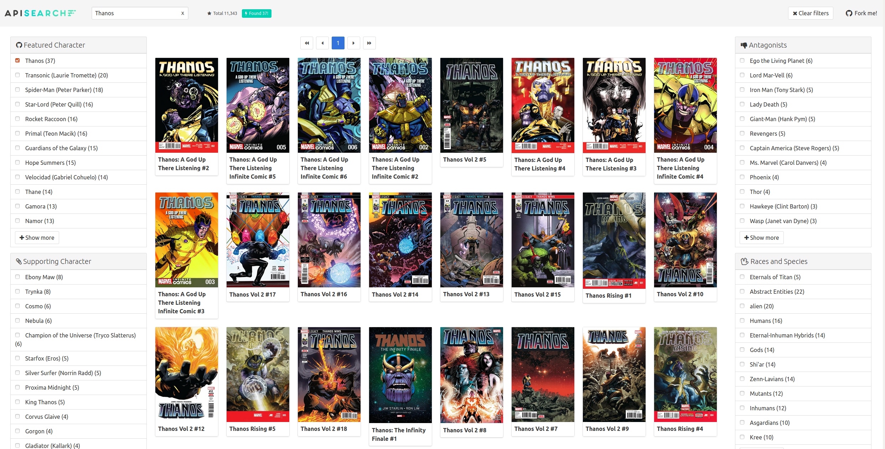

# First example

So let's make our first example. In order to bring to you everything you need
for that in only few lines, we will work with a repository created by us called
[Basic Infrastructure](https://github.com/apisearch-io/basic-infrastructure), a
basic set of Docker containers properly configured that will emulate what
Apisearch could easily look like in your own servers.

```bash
wget --no-check-certificate --content-disposition -O basic-infrastructure.tar.gz https://github.com/apisearch-io/basic-infrastructure/archive/master.tar.gz
tar -xvzf basic-infrastructure.tar.gz
cd basic-infrastructure-master
docker-compose up
```

Here is the list of what you will have.

- Compatible Elasticsearch cluster (with 1 node)
- A Redis server - Real time and distributed data analysis, like security
checks.
- A Mysql 8 server (Apisearch can work with old Mysql versions) - Database layer
- A RabbitMQ server - Queue layer
- Logstash and Kibana - You will be able to check the domain events that happen
inside Apisearch
- A cluster of 2 server replicas, balanced by the simple and tiny
[ReactPHP load balancer](https://github.com/driftphp/tiny-load-balancer) by
[DriftPHP](https://driftphp.io)

By default, all pieces are properly configured, so the main distribution of the
packages offers a `.env` file in the root of the project.

## Checking the infrastructure

That's it. Congratulations. You already have Apisearch running in your server.
Now let's go a little bit further with that. First of all, our first call to
Apisearch, the Apisearch *hello world*. As you can see, we will use the
environment variable **APISEARCH_GOD_TOKEN** as the token to use everywhere,
with full access to the entire environment.

```bash
curl \
    --silent --head \
    --write-out '%{http_code}\n' \
    --header "Apisearch-Token-ID: 6326d504-0a5f-f1ae-7344-8e70b75fcde9" \
    'http://localhost:8100'
```

That curl should return us a **204**. This endpoint can only be used with the
**APISEARCH_PING_TOKEN** value in your environment variable list. Remember to
use your own value, different from this example.

Let's make another fast check of our infrastructure by calling our check
endpoint. This endpoint will give some information about the status of the
cluster and the services working inside.

```bash
curl \
    --header "Apisearch-Token-ID: 0e4d75ba-c640-44c1-a745-06ee51db4e93" \
    'http://localhost:8100/health'
```

That curl should return us a **200**. This endpoint can only be used with the
**APISEARCH_GOD_TOKEN** value in your environment variable list. Remember to
use your own value, different from this example.

### Checkpoint! Have any problem?

At this point you might encounter some of these problems. Please, check all of
them if you have any issue, and if any of them is not included in this list,
please ping the organization in our 
- [Join us on slack](https://apisearch.slack.com) - or [Get an invitation](https://apisearch-slack.herokuapp.com/)
- [Open an Issue on Github](https://github.com/apisearch-io/search-server/issues/new)
- [Tweet us](https://twitter.com/apisearch_io)

> Docker cannot even start. This message appears: **WARNING: The APISEARCH_PORT
> variable is not set. Defaulting to a blank string.**  
> In this case, please check that there is a file called **.env** in the root of
> Apisearch server with the required APISEARCH_* environment values.

> Docker is telling that some ports are already mapped by anyone else.  
> This project exports these ports: **8100** as the server entrypoint (this
> value is defined as an environment value, feel free to change it),
> **8200..8204** as the Apisearch enabled workers, **9200** as the Elasticsearch
> port, and **6379** as the redis port.  
> Make sure that these ports are not being used in your local host or in any 
> Docker container

> Elasticsearch stops with a message like this: **apisearch_elasticsearch | [1]: 
> max virtual memory areas vm.max_map_count [65530] is too low, increase to at 
> least [262144]**.  
> Follow the instructions [Here](https://www.elastic.co/guide/en/elasticsearch/reference/current/docker.html#docker-cli-run-prod-mode)
> to solve that problem and restart the docker

> Apisearch do not respond properly with the admin token you've proposed.
> In this case, please check that there is a file called **.env** in the root of
> Apisearch server with the required APISEARCH_* environment values.


## Creating our first Application

Once we have our engine running properly, it's time to create our first
application. As the server exposes an entire API for managing our data, we will
use some endpoints for our purpose.

> You can use our console commands for that purpose. In order to enter one of
> the servers, use the docker command "docker exec -it apisearch.server_1 sh"
> and you'll be automatically located in the root of the project.

Here you have our next steps, one by one.
- Create a new index under a new application
- Create some tokens under this new application in order to grant some access to
this index and its data.
- Import some items from an exported file
- Make some queries

Let's start from the beginning. An application under Apisearch scope is just a
virtual entity that can contain indices and tokens. Applications are not
created explicitly, but they are as soon as someone creates something inside it.

Let's start creating a new application called "marvel" and an index called
"comics", where we will place an entire comic database.

<!-- tabs:start -->
#### ** HTTP **
```bash
curl \
    -XPUT \
    --header "Apisearch-Token-ID: 0e4d75ba-c640-44c1-a745-06ee51db4e93" \
    'http://localhost:8100/v1/comics/indices/marvel'
```

#### ** Console **
```bash
bin/console apisearch:create-index marvel comics
````
<!-- tabs:end -->

Great! You already created an index called **comics** under the application
**marvel**. Now it's time to create some tokens in order to grant specific
access to this new index instead of keep using this **GOD_TOKEN**. Keep in mind
that this token grants full access to your application.

Once we have an index created, let's check the status of the index. This
feature only checks that the index is properly created and ready to be used.

<!-- tabs:start -->
#### ** HTTP **
```bash
curl \
    --head \
    --header "Apisearch-Token-ID: 0e4d75ba-c640-44c1-a745-06ee51db4e93" \
    'http://localhost:8100/v1/marvel/indices/comics'
```

#### ** Console **
```bash
bin/console apisearch:check-index marvel comics
````
<!-- tabs:end -->

Ok! Let's continue with some tokens creation. In our case, we want to create two
different tokens. The first one will be specifically created for index
management. With this new token, we will be able to manage items (create new
items, update and delete existing ones), and in order to avoid confusion between
both, this first token will not have access to query the index.

Each token can have some routes or topics associated (a topic is a group of
related routes).

<!-- tabs:start -->
#### ** HTTP **
```bash
curl \
    -XPUT \
    --header "Apisearch-Token-ID: 0e4d75ba-c640-44c1-a745-06ee51db4e93" \
    --header "Content-Type: application/json" \
    --data '{"endpoints": ["catalog"]}' \
    'http://localhost:8100/v1/marvel/tokens/665396d6-bc44-11ea-b3de-0242ac130004'
```

#### ** Console **
```bash
bin/console apisearch:add-token marvel 665396d6-bc44-11ea-b3de-0242ac130004 --endpoint=catalog
````
<!-- tabs:end -->

The second token will only have access to queries. This token will be published
in our website, as Apisearch loads results directly from the source. This token
will return `404` if it's used in catalog management, for example.

<!-- tabs:start -->
#### ** HTTP **
```bash
curl \
    -XPUT \
    --header "Apisearch-Token-ID: 0e4d75ba-c640-44c1-a745-06ee51db4e93" \
    --header "Content-Type: application/json" \
    --data '{"endpoints": ["query"]}' \
    'http://localhost:8100/v1/marvel/tokens/fcfb8436-bc53-11ea-b3de-0242ac130004'
```

#### ** Console **
```bash
bin/console apisearch:add-token marvel fcfb8436-bc53-11ea-b3de-0242ac130004 --endpoint=query
````
<!-- tabs:end -->

And *voilà*, we have a created index ready to receive some items, and two
different tokens to start interacting with the server.

Next steps are feeding our index with items. In this step we have many
strategies to do this, but the most efficient way, and because we have an
exported file already in our server (explicitly added in our docker-composer
configuration, but not distributed in the regular server image), we can use the
Apisearch import feature. We are about to index more than 11K comics, so this
process could last up to 3 minutes, depending on your processor.

<!-- tabs:start -->
#### ** HTTP **
```bash
curl \
    -XPUT \
    --header "Apisearch-Token-ID: 0e4d75ba-c640-44c1-a745-06ee51db4e93" \
    'http://localhost:8100/v1/marvel/indices/comics/import?feed=file:///marvel.as'
```

#### ** Console **
```bash
bin/console apisearch:import-index marvel file:///marvel.as
````
<!-- tabs:end -->

Great! If your reading this, you can be proud you already have a data set of
more than 11K comics in your Apisearch instance. Let's make some searches now
to test that we already have what we think we really have.

<!-- tabs:start -->
#### ** HTTP **
```bash
curl \
    -XGET \
    --header "Apisearch-Token-ID: 0e4d75ba-c640-44c1-a745-06ee51db4e93" \
    --header "Content-Type: application/json" \
    --data '{"q": "deadpool"}' \
    'http://localhost:8100/v1/marvel/indices/comics'
```

#### ** Console **
```bash
bin/console apisearch:query marvel comics deadpool
````
<!-- tabs:end -->

Once we have a working index with our data set, let's start with the UI part of
the project. Let's create a search bar on top of marvel comics.

## Creating our search bar

Inside the folder `/marvel` you will find a file named `index.html`. Open it in
your browser *(file:///.../marvel/index.html)* and you will find an already
working search engine on top of your created index.

As you will be able to see, we have built a complete search engine on top of all
marvel comics we have in this small database, so feel free to find your
favourite superhero or supervillain. And if you feel that the search engine is
not what you expected, in terms of search results, maybe it's time to start
digging inside the implementation, both from the ingestion part of the
application (check our [Model](model.md) for understanding what an item is 
inside Apisearch environment and how can it be built), or from the
consumption part of the application (you can change many parameters of the
search engine. Check our [UI Reference](ui-reference.md) for all these small
improvements and configuration flags)  



## Next steps

Here you have some next steps for you if you're interested a bit more about how
Apisearch works under the hood, about how you can create infinite adapters
around our model and about how you can reach the best possible experience with
our project.

Are you interested in **the server**?

- [How the server works](server.md)
- [How to configure the server](server-configuration.md)
- [How to use console commands](console.md)
- [How the model is designed](model.md)

Are you interested in **the UI**?

- [How to create queries](query-creation.md)
- [How to manupulate results](result-manipulation.md)
- [Let me start with UI](ui-quickstart.md) or [Show me the UI Reference](ui-reference.md)
- [Apisearch and CDN](plugin/fastly.md)

Are you interested in **the community and the project**?

- [Request a Slack invitation](https://apisearch-slack.herokuapp.com/)
- [Join us at Slack](https://apisearch.slack.com)