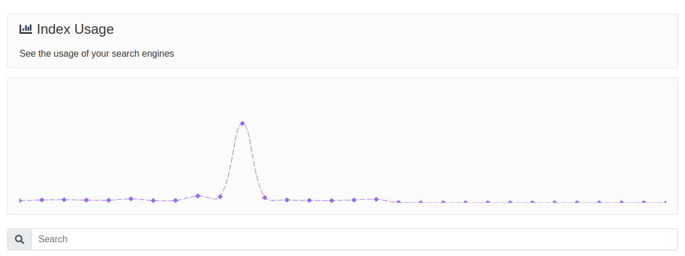

## Apisearch #1 - November 2020

Welcome to this brand new Apisearch newsletter about new features, improvements
in the application and next steps. In this newsletter you will find all you need
to improve your search layer in your website by using the last updates, some
advices and tons of information about the project.

### Server updates

You will find the Apisearch server in this 
[Github repository](https://github.com/apisearch-io/search-server).

* HEALTH_CHECK_TOKEN environment variable - [Pull Request](https://github.com/apisearch-io/search-server/pull/421)
* Database encryption strategy for sensible fields - [Pull Request](https://github.com/apisearch-io/search-server/pull/413)
* Campaigns plugin - [Pull Request](https://github.com/apisearch-io/search-server/pull/410)
* JWT plugin - [Pull Request](https://github.com/apisearch-io/search-server/pull/416)
* Added new interactions (buy, fav) - [Pull Request](https://github.com/apisearch-io/search-server/pull/418)

### UI updates

You will find the Apisearch UI library in this 
[Github repository](https://github.com/apisearch-io/search-ui).

* Infinite Scroll- [Docs](https://docs.apisearch.io/#/ui/recipes?id=infinite-scrolling) - [Demo](https://apisearch-io.github.io/search-ui/examples/infinite-scroll.html)
* Autocomplete - [Docs](https://docs.apisearch.io/#/ui/recipes?id=autocomplete-input) - [Demo](https://apisearch-io.github.io/search-ui/examples/standard-search.html)
* Range filters - [Docs](https://docs.apisearch.io/#/ui/reference?id=range-filter) - [Demo](file:///var/www/apisearch/search-ui/examples/minimum-setup.html)
* Checkbox filter - [Docs](https://docs.apisearch.io/#/ui/reference?id=checkbox-filter)

### Admin updates

You can start using Apisearch as a service in our hosted application. This
feature is still only available for partners and resellers, so feel free to
contact us - hello@apisearch.io - if you want a easy access user.

* Experimental UI access. Make you index use the more experimental UI features.
Available for all indices, but only recommended for development ones.
* Autocomplete and Highlights options under the Search Layer configuration
* New Iframe endpoint. You can embed your search engine my using an iframe.
You will find all the information inside the Search layer configuration. 
* New User usage endpoint. Check your whole usage in the platform.

### Next features

#### Deep Learning Recommender

The Apisearch team is working so hard in a Deep Learning model in order to be
able to provide a smart recommender for your website. By using our interactions
API, you will send us your user interactions with your items, and by processing
all this data layer, we will provide you an amazing API with recommendations for
your users.

This layer will also work as a more-like-this processor, so we will return you
N items similar to some other items provided by you.

Let's see some possible usages for this feature.

- You can suggest similar items when in the cart page
- You can suggest similar items when in a product page
- You can recommend items to your users similar to their last 10 viewed items
- You can recommend items to your users by having historical interactions and
global behavior
- You can add an "Other users bought" slider in your home page

...and many more. This plugin will be the start of this second project phase, 
mainly focused on how to return better results and how to learn from your users
behavior.

This service will be exposed as a private service, automatically integrated with
the Apisearch SAAS version.

#### Magento Plugin

We're working in a new partnership with a Catalan company that work in Magento
projects. As soon as we close this partnership, we will start creating the
open sourced Magento plugin for magento, including v1 and v2. In this plugin you
will easily add Apisearch in your ecommerce, having access to the amazing admin
application and entering a whole new world of search power.

#### Admin improvements

We're working as well in some admin improvements

- Token permissions - Right now, you can define if a Token is an admin one, or
a query one. Admin tokens can't be used as query ones, so that would introduce a
serious security issue. In this new feature, you will be able to configure 
permissions per endpoint or group of endpoints.
- Admin translations - You will find the whole Admin platform in english. Soon
in more languages.
- Multiple UI layers - Right now, you can attach one single template and UI
configuration per index. What if you could have several UI layers for the same
index? What if you could build several search engines from the same data?
- Parsing service - Do you want us to parse your data once per day? Well, this
feature will be soon available